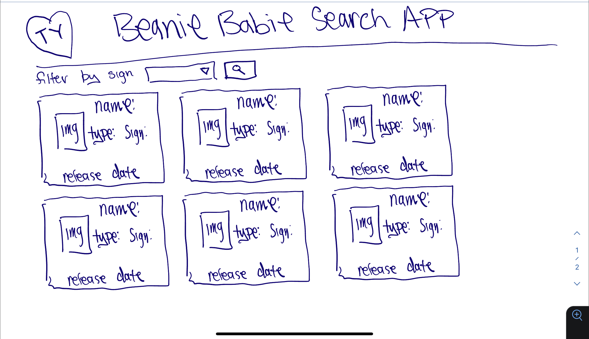

## HTML

-   header

    -   ty logo
    -   h1 Beanie Baby Search App

-   section
    -   form for search selection
        -   select - to display filter options
        -   button - to submit form
-   section
    -   beanie baby divs (cards) go here

## State

-   let babiesData = [];
-   let signsData = [];

## Events

-   on page load
    -   show list of all beanie babies and populate dropdown menu with astro sign options
-   on form submit
    -   show only the filtered beanie babies based on astro sign selected
